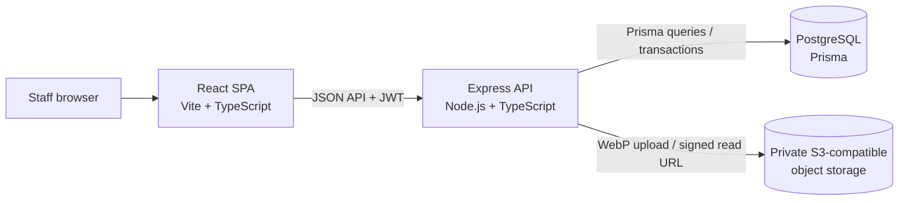

# System Architecture

This document describes how the application is structured and how requests and data move through it. It focuses on implementation boundaries and technical decisions rather than a catalogue of hotel workflows.

## 1. System shape

The repository is an npm-workspaces monorepo with two independently started TypeScript applications. The browser application communicates with a stateless HTTP API. PostgreSQL is the durable source of truth; private object storage holds ID images.



The UI is a Vite-hosted React single-page application in `apps/web`. It uses TypeScript, Tailwind CSS and a small set of local CSS components. Page state and navigation are managed in the client; authenticated data is requested from the API rather than copied into a second persistence layer in the browser. In development, Vite proxies `/api` to Express. A production frontend build is served by the API process when `apps/web/dist` exists, so staff can use one LAN host and port.

The server is an Express application in `apps/api`. It listens on the configured port, installs security headers, CORS and JSON parsing, mounts domain routers under `/api`, returns JSON 404s for unknown API routes, optionally serves the built SPA, and then installs not-found and error middleware. There is no public booking frontend or third-party booking integration in this deployment.

## 2. Repository boundaries

```text
apps/
  api/
    prisma/       Prisma schema and seed program
    src/
      config/     Environment parsing
      lib/        Prisma client, HTTP errors, audit helper
      middleware/ Authentication, role checks, error mapping
      modules/    HTTP routers grouped by domain
  web/
    src/
      lib/        API client and token handling
      App.tsx     Authenticated application shell and pages
      index.css   Responsive application styles
docs/
  architecture.md
docker-compose.yml
```

The API modules are the route-level ownership boundaries. A module defines its routes, parses request data with Zod, performs authorization where needed, reads or writes its domain records through Prisma, and emits an audit event for important mutations. Shared concerns live in middleware and `src/lib`. The current implementation keeps most use-case logic in the module routers; a separate service layer can be introduced if domain logic grows or needs reuse outside HTTP handlers.

## 3. HTTP request lifecycle

1. Express applies Helmet, the configured CORS allowlist, and a JSON body-size limit.
2. `/api/health` is handled without authentication. `/api/auth/login` validates credentials, compares the bcrypt hash and issues a signed JWT.
3. Other `/api` routes pass through authentication. The API verifies the JWT, loads the current user from PostgreSQL, and rejects expired, missing, disabled or invalid accounts. The database lookup makes account deactivation and role changes effective without waiting for the token to expire.
4. Routers apply role authorization and parse body/query parameters with Zod before executing the use case.
5. Prisma errors, validation errors and explicit HTTP errors are translated into consistent JSON error responses by the final error middleware.

The frontend API helper adds the bearer token, parses JSON responses, and clears the local session when the API returns `401`. Role checks are repeated on the server; hiding a page or control in React is only a usability measure.

## 4. Domain and persistence model

`apps/api/prisma/schema.prisma` defines the PostgreSQL schema and generated Prisma client. The schema uses explicit enums for roles and operational states, `Decimal` columns for monetary values, date-only columns for planned arrival/departure dates, and foreign-key relations for core entities.

The main entity relationships are:

```mermaid
erDiagram
    GUEST ||--o{ RESERVATION : books
    GUEST ||--o{ STAY : has
    ROOM ||--o{ RESERVATION : assigned_to
    ROOM ||--o{ STAY : occupied_by
    RESERVATION ||--o| STAY : becomes
    STAY ||--o| FOLIO : opens
    FOLIO ||--o{ FOLIO_ITEM : contains
    FOLIO ||--o{ PAYMENT : receives
    STAY ||--o{ ROOM_MOVE : records
    GUEST ||--o{ GUEST_DOCUMENT : owns
    USER ||--o{ ACTIVITY_LOG : performs
```



Reservations represent planned occupancy; stays record actual check-in, checkout and current room assignment. This preserves a completed stay when its original reservation changes status and gives room moves an explicit history. Guest insights are calculated from stay and folio/payment history rather than maintained as counters that can drift.

Reservation entry searches guest records by name, phone and ID number before creating a profile. The API tokenizes the query and matches all entered terms against guest identity fields; selecting a match passes its `guestId` to reservation creation, reusing the existing row. Room filtering is a client-side view over the small room inventory, with “free” including Available, Clean and Inspected statuses and occupancy based on the Occupied status.

Folio items represent charges and adjustments; payment rows represent received tenders. Balances are derived as item totals minus payment totals. Room/booking overlap and assignment rules are checked by API use cases, with serializable transactions on reservation creation, check-in and room moves to reduce conflicting concurrent assignments. These application checks complement the relational constraints; they are not a database exclusion constraint.

For local development, `docker-compose.yml` starts PostgreSQL. `apps/api/prisma/seed.ts` inserts the initial 12 rooms and an administrator account. Prisma migrations are the schema-change mechanism; use `migrate dev` for local development and apply reviewed migrations with `migrate deploy` in production.

## 5. ID-image storage boundary

ID image bytes never enter PostgreSQL. The authenticated upload route accepts an image in memory, validates its media type and request size, rotates it according to image metadata, limits the width to 1000 px, converts it to WebP, and lowers quality/resolution as needed to keep the result compact. The compressed bytes are uploaded to a private S3-compatible bucket. PostgreSQL stores the guest reference, object key, document type, MIME type, file size and upload metadata.

When an authorized staff member asks to view a document, the API checks the document record and returns a five-minute signed GET URL. The bucket must remain private; the API does not return public URLs. Supabase Storage can be configured through its S3-compatible endpoint, as can an S3-compatible service reachable on the hotel LAN.

## 6. Authentication, authorization and audit

Passwords are stored as bcrypt hashes. JWTs contain a user subject and are signed with a deployment secret. Each protected request resolves that subject against the active user row before setting the request identity. Role middleware enforces `ADMIN`, `MANAGER` and `RECEPTIONIST` access at route boundaries. The admin-only user API supports account activation, deactivation and deletion; inactive accounts fail authentication and existing JWTs fail on their next request. Legacy worker accounts remain manageable by admins but are blocked from signing in; the application has no worker or housekeeping task interface.

Administrator password recovery is unauthenticated but verifies the submitted email belongs to an active `ADMIN` account and checks a deployment-only `ADMIN_RECOVERY_KEY` using a constant-time digest comparison. The key is not stored in PostgreSQL. Recovery is unavailable when the key is not configured, and this route cannot reset receptionist or worker accounts. Receptionists use the normal admin-managed password change path.

Important changes create `ActivityLog` rows with the actor, action, entity reference, request IP and optional JSON details. Audit writes are best-effort so an audit-storage issue does not turn a committed business operation into an apparent failure. Sensitive ID-image paths are not included in guest-profile responses; access uses a separate signed-URL route.

## 7. Configuration and runtime

Configuration is read from environment variables and validated in `apps/api/src/config/env.ts`. The API needs a PostgreSQL connection URL, a strong JWT secret, a web-origin allowlist and a port. Set `ADMIN_RECOVERY_KEY` to enable admin password recovery. ID image upload additionally needs a private S3-compatible endpoint, bucket and credentials. The web app uses a same-origin `/api` path by default; `VITE_API_URL` can override it for a split deployment.

The API and PostgreSQL can run on a local hotel network so staff workflows do not depend on a public booking service or constant internet access. Object storage must also be reachable when an ID photo is uploaded; use a LAN object store where public connectivity is unreliable. The API has no in-memory business state, so multiple API instances can share the same PostgreSQL database and bucket if a larger deployment later requires that.

## 8. Extension points

- Add domain logic as a module-level use case first; extract a `services/` or repository layer when logic is shared, grows substantially, or needs independent testing.
- Add schema changes in Prisma, generate a reviewed migration, and update the owning API module and frontend client types together.
- Add asynchronous or external integrations behind a new adapter/module rather than coupling them to Express handlers or Prisma models.
- Keep generated guest and operational reports as database queries while the data volume remains small; introduce cached projections only when measured query cost justifies the extra consistency work.

## 9. Financial and operational safeguards

Folio balances are derived from signed charge rows and received payments. Payment recording runs in a serializable transaction, rejects closed folios and amounts above the remaining balance, and checkout verifies that the balance is exactly zero before closing the folio. Charge corrections are limited to open folios and create activity-log entries; payments are retained as append-only records. A room transfer records the move and marks the previous room Dirty; the front desk manages room readiness from the room board. The transfer posts the higher-rate difference for remaining nights if needed. A lower-rate room keeps the existing contracted rate because this first version does not record cash refunds.

Daily close is a create-once snapshot keyed by business date. It records active inventory, end-of-day occupied rooms, arrivals/departures, room revenue for that night (the in-house nightly rates), other charges posted that date, payment totals by tender, outstanding balances, ADR and RevPAR. Repeating a close returns the stored snapshot instead of rewriting its values. Manager and Admin users can view guest insights and daily close data; only Admin can view the activity log or manage staff accounts. These checks are enforced in API middleware and routes, with the UI mirroring them for simpler navigation.

ID uploads are normalized to WebP at no more than 1000 px wide. The API tries a bounded set of dimensions and quality settings and rejects an upload if it cannot bring it below 150 KB, preventing unexpectedly large ID files from reaching storage.
